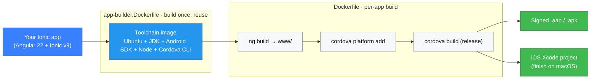

<div align="center">

# 🛠️ Ionic Cordova App Builder

**Produce a signed Android app (`.aab`/`.apk`) and a ready-to-finish iOS Xcode project from an Ionic app — using nothing but Docker.**

No local Android SDK, no Xcode-on-Linux gymnastics, no "works on my machine". Drop these files into your Ionic project and build.

[](https://github.com/capellasolutions/ionic-cordova-docker/actions/workflows/build.yml)


</div>

> [!NOTE]
> **Prefer Capacitor?** See the sibling project **[ionic-capacitor-docker](https://github.com/capellasolutions/ionic-capacitor-docker)** — the same Dockerized pipeline built around Capacitor (and it defaults to **pnpm** instead of npm). Same idea, a different "way".

---

## Contents
- [Highlights](#highlights)
- [How it works](#how-it-works)
- [Quick start](#quick-start)
- [Repository layout](#repository-layout)
- [The demo app (`example-app`)](#the-demo-app-example-app)
- [Usage](#usage)
  - [1. Build the toolchain image](#1-build-the-toolchain-image)
  - [2. Build your app](#2-build-your-app)
  - [3. Get the build out](#3-get-the-build-out)
- [Verifying and using the Android build](#verifying-and-using-the-android-build)
- [Continuous integration](#continuous-integration)

---

## Highlights

- 🤖 **Reproducible builds in Docker** — a heavy, cacheable *toolchain image* (Ubuntu + JDK + Android SDK + Node + Cordova/Ionic CLIs) and a light *per-app build* on top of it.
- 🔐 **Signed Android releases** out of the box — Cordova reads the keystore from `build.json`, so a clean `cordova build` produces an upload-ready `.aab`/`.apk`.
- 🍏 **iOS prepared on Linux** — Cordova generates the Xcode project (and Pods, when a plugin needs them); you just finish the build on macOS.
- 🅰️ **Modern, zoneless stack** — Angular 22 + Ionic v9 (no `zone.js`), esbuild builder, TypeScript 6, Vitest.
- 📦 **Bring your own package manager** — `npm`, `yarn`, or `pnpm` via one build-arg; only the selected one is installed (no Corepack, future-proof for Node 25+).
- 🌱 **Fresh platforms every build** — `cordova platform add` regenerates `platforms/` at build time (not committed), so the build is stateless and the bundle id is injected per build.
- 🎯 **Dev/prod switching** — environment files and Firebase config are swapped at build time so one optimized build can target either backend.
- ✅ **CI included** — drift-guard, lint/build/test, and an end-to-end Android build; Dependabot keeps everything current.

## How it works

The native `platforms/` folder is generated fresh inside Docker on every build (it is not committed), so the `Dockerfile` injects your `PACKAGE_ID` into `config.xml` before `cordova platform add` runs. The Android release is signed from `build.json`, so the build needs no hand-edits to the generated Gradle project.



## Quick start

The bundled **`example-app`** is self-contained — clone and build it to exercise the whole pipeline end-to-end:

```shell
cd example-app
./build-mobile.sh
```

That builds the toolchain image, builds the demo, and copies the artifact into `build-output/`. Pick a platform directly with `./build-mobile.sh android` (or `ios` / `all`).

## Repository layout

| Path | What it is |
| --- | --- |
| `app-builder.Dockerfile` | Builds the heavy **toolchain base image** (Ubuntu + JDK + Android SDK + Node + Cordova/Ionic CLIs). Build it once and reuse it. |
| `Dockerfile` | `FROM app-builder` — copies your app in, builds the Angular web app, then runs `cordova build`. The per-app build. |
| `build-mobile.sh` | Convenience wrapper that builds both images and copies the artifact out. |
| `example-app/` | A small **Angular 22 + Ionic v9 (zoneless) + Cordova** demo you can clone and build immediately. |

> [!IMPORTANT]
> `example-app/` carries its **own copies** of the template files above, because Docker can't reach files outside its build context — the copies are required, not accidental. The root files are the source of truth; the `example-app` copies of `Dockerfile` and `app-builder.Dockerfile` are kept **byte-for-byte identical** (CI enforces this). `example-app/build-mobile.sh` is intentionally slightly different (it uses `version=0.0.0` and a self-contained header comment).

## The demo app (`example-app`)

The bundled demo is a small **Angular 22 + Ionic v9 + Cordova** app that runs **fully zoneless** (no `zone.js`). It exercises the Docker pipeline end-to-end and doubles as an up-to-date reference for the modern toolchain:

- **Angular 22** with the esbuild `@angular/build:application` builder, standalone components and signals — zoneless by default (`provideZonelessChangeDetection()`), no `zone.js` in the bundle.
- **Ionic v9** (`@ionic/angular@^9`, now stable) — Angular 21/22 support and zoneless by default. v9 promotes the standalone build to the package root, so components come from `@ionic/angular` instead of the old `@ionic/angular/standalone` subpath.
- **Cordova** with **cordova-android 15** (SDK Platform 36, Build Tools 36.0.0). The Cordova CLI is installed globally in the toolchain image.
- **npm** is the default package manager (`yarn`/`pnpm` are supported too — see `PACKAGE_MANAGER`). The Capacitor sibling defaults to pnpm instead.
- **TypeScript 6**, **Vitest** (jsdom) for unit tests, **angular-eslint** for linting.
- The toolchain base image builds on **Ubuntu 26.04**.

`npm run build` emits a flat `www/` (so Cordova finds `www/index.html`), and the production configuration swaps `src/environments/environment.ts` for `environment.prod.ts` — the Dockerfile first copies `environment.<ENV_NAME>.ts` over `environment.prod.ts` so one production build can target dev or prod.

## Usage

### 1. Build the toolchain image

It is separated so you don't waste time rebuilding it every time you build a new app.

```shell
docker build . -f ./app-builder.Dockerfile -t app-builder
docker push app-builder   # only if you distribute it to a registry
```

Optionally pass `--build-arg`s:

```shell
docker build . -f ./app-builder.Dockerfile \
  --build-arg PACKAGE_MANAGER=yarn \
  --build-arg ANDROID_PLATFORMS_VERSION=36 \
  -t app-builder
```

*You can rename `app-builder` to whatever you like, but then change it inside `Dockerfile` too (the `FROM app-builder` line).*

<details>
<summary><b>Docker builder arguments</b> (defaults shown)</summary>

| Argument | Default | Notes |
| --- | --- | --- |
| `GRADLE_VERSION` | `8.14.5` | Gradle installed in the image and used for the Cordova wrapper. cordova-android 15 uses an AGP 8.x plugin, so stay on Gradle 8.x. |
| `JAVA_VERSION` | `21` (LTS) | cordova-android 13–15 officially document JDK 17, but AGP 8.x / Gradle 8.5+ also run on JDK 21. JDK 25 would need AGP 9 / Gradle 9.1+. |
| `ANDROID_PLATFORMS_VERSION` | `36` | Android platform (compile/target SDK) to install. |
| `ANDROID_BUILD_TOOLS_VERSION` | `36.0.0` | Android build-tools version (cordova-android 15 requires Build Tools 36.0.0). |
| `ANDROID_SDK_TOOLS_VERSION` | `14742923` | Android command-line tools build number. |
| `PACKAGE_MANAGER` | `npm` | `npm`, `yarn`, or `pnpm`. Only the **selected** manager is installed (npm ships with Node; yarn/pnpm are added on demand with `npm install -g`). This avoids Corepack, which is being unbundled from Node 25+. Also selects how `Dockerfile` installs *your app's* dependencies (`npm ci` / `yarn install --frozen-lockfile` / `pnpm install --frozen-lockfile`) — commit the matching lockfile. |
| `NODE_VERSION` | `24` (LTS) | Node.js major (installed via NodeSource). |
| `YARN_VERSION` | `stable` | Yarn version (installed only when `PACKAGE_MANAGER=yarn`). |
| `PNPM_VERSION` | `latest` | pnpm version (installed only when `PACKAGE_MANAGER=pnpm`). |
| `USER` | `ionic` | Helpful for permissions. |
| `CORDOVA_VERSION` | `13.0.0` | Cordova CLI version (installed globally in the image). |
| `IONIC_CLI_VERSION` | `7.2.1` | Ionic CLI version. |

</details>

> [!TIP]
> Check the [Android Platform Guide](https://cordova.apache.org/docs/en/latest/guide/platforms/android/) first, make sure you have a matching `cordova-android` in `package.json`, and that `<preference name="android-targetSdkVersion" value="X" />` in `config.xml` matches `ANDROID_PLATFORMS_VERSION`.

### 2. Build your app

```shell
docker build . \
  --build-arg ENV_NAME="${ENV_NAME}" \
  --build-arg PACKAGE_ID="${PACKAGE_ID}" \
  --build-arg PLATFORM=${platform} \
  --build-arg VERSION="${version}" \
  -f ./Dockerfile \
  -t app-build
```

| Argument | Meaning |
| --- | --- |
| `PACKAGE_ID` | The bundle id you use for your app (injected into `config.xml`). |
| `ENV_NAME` | `prod` or `dev`, depending on what your environment files are called inside the `environments` folder. |
| `PLATFORM` | `ios`, `android`, or both via `all`. |
| `VERSION` | Optional override for the version specified inside `config.xml`. See `Dockerfile` and uncomment the line that sets it. |
| `PACKAGE_TYPE` | Android artifact type — `bundle` (`.aab` for Google Play, default) or `apk` (installable on a device). Overrides `packageType` in `build.json`. |

### 3. Get the build out

**Android:**
```shell
docker run --user root:root --privileged=true -v ./build-output:/app/mount:Z --rm --entrypoint cp app-build -r ./output/android /app/mount
```

**iOS** (can only be *prepared* on Linux, never compiled — finish on macOS; run `pod install` there if you use firebasex):
```shell
docker run --user root:root --privileged=true -v ./build-output:/app/mount:Z --rm --entrypoint cp app-build -r ./output/ios /app/mount
cd ./build-output/ios && pod repo update && pod install
```

There is a `build-mobile.sh` file if you want to run all these steps from a shell (you can comment out the first part later).

## Verifying and using the Android build

The Android build is copied to `build-output/android`. By default it produces a **signed Android App Bundle** (the file you upload to the Google Play Console):

```
build-output/android/app/build/outputs/bundle/release/app-release.aab
```

The `intermediary-bundle.aab` under `.../intermediates/` is a Gradle scratch file — ignore it.

Verify the artifact is signed:

```shell
jarsigner -verify build-output/android/app/build/outputs/bundle/release/app-release.aab
# -> "jar verified."
```

An `.aab` cannot be installed on a device directly. To get an **installable APK** (e.g. for sideload testing), build with `PACKAGE_TYPE=apk`:

```shell
PACKAGE_TYPE=apk ./build-mobile.sh android
```

The APK then lands under `build-output/android/app/build/outputs/apk/release/`. Alternatively, generate APKs from an existing bundle with [bundletool](https://developer.android.com/tools/bundletool):

```shell
bundletool build-apks --mode=universal \
  --bundle=app-release.aab --output=app.apks \
  --ks=keys/android.jks --ks-key-alias=alias_name
```

> [!WARNING]
> **Signing key:** the demo signs with the committed `keys/android.jks` (passwords `Changeit` in `build.json`). For a real app, generate your **own** keystore, keep it out of source control, and supply the passwords via secrets/environment — an app signed with the demo key can never be updated on Play by you.

## Continuous integration

`.github/workflows/build.yml` runs on push/PR and:

1. checks the `example-app` Docker copies (`Dockerfile`, `app-builder.Dockerfile`) haven't drifted from the root files,
2. lints, builds and unit-tests the demo app, and
3. builds the toolchain image and the demo Android app end-to-end.

`.github/dependabot.yml` keeps the demo's npm dependencies, the Docker base images, and the GitHub Actions up to date.

---

<div align="center">

Good Luck 🧡

**[Al-Mothafar Al-Hasan](https://github.com/almothafar)** from **[Capella Solutions](https://www.capellasolutions.com/)**

</div>
